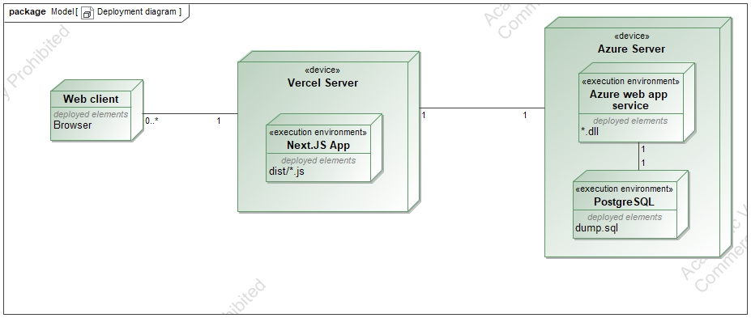

# ApiaryAdmin

## Aprašymas
ApiaryAdmin sistema skirta bitininkams administruoti savo bitynus. Naudotojai gali kurti bitynus, pridėti avilius ir vykdyti jų apžiūras. Sistema padeda tvarkyti informaciją apie bitynų būklę, avilių būklę ir atliktas apžiūras.

Taikomosios srities objektai: **Bitynas** (Apiary) -> **Avilys** (Hive) -> **Apžiūra** (Inspection).

---
## Funkcionalumas (funkciniai reikalavimai)

* Sistemoje veiks naudotojų autentifikacija, o naudotojai bus skirstomi į svečius, registruotus naudotojus (bitininkus) ir administratorius.
* **Svečias** gali peržiūrėti viską.
* **Registruotas naudotojas** (bitininkas) gali atlikti šiuos veiksmus:
  - Kurti ir valdyti savo bitynus.
  - Pridėti naujus avilius į savo bitynus.
  - Registruoti avilių apžiūras ir tvarkyti apžiūrų įrašus.
  - Atlikti CRUD (sukurti, peržiūrėti, redaguoti, pašalinti) operacijas tik su savo turiniu (bitynais, aviliais, apžiūromis).
* **Administratorius** turi visas teises ir gali valdyti ne tik savo, bet ir kitų naudotojų turinį bei naudotojų paskyras.

---
Naudojamos technologijos:
- **Frontend**: Next.JS su TypeScript
- **Backend**: .NET (ASP.NET Core)
- **Duomenų bazė**: PostgreSQL

Deployment diagrama:

Figma:
https://www.figma.com/design/AWeUdSbF5ZNeWhPoKi3J8I/Saitynai?node-id=0-1&t=xqWwb7iVqiqk99ta-1

